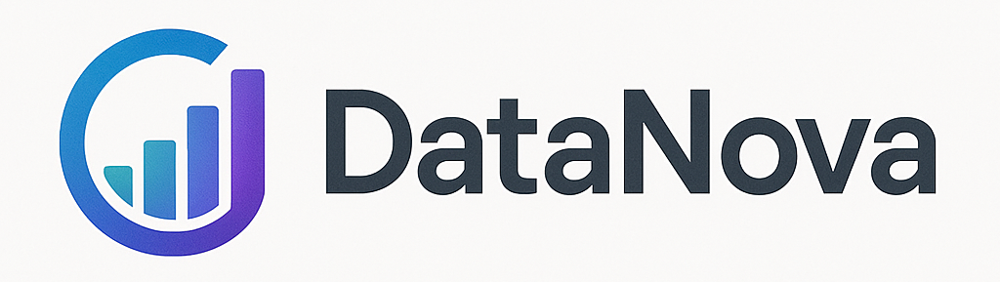
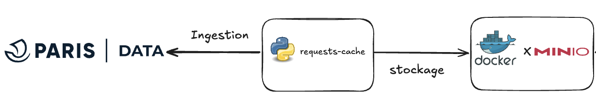

<div align="center">




# PARIS EVENTS ANALYZER

</div>

# Mission 1 - UV

## Ingestion & Stockage des données

<div align="center">



</div>

## Pré-requis

- **UV** : gestionaire tout en un d'environnement Python.
- **Docker Desktop** : Pour exécuter la mise en place du stockage des données.
- **Make** ou **Just** [Optionel]: Pour automatiser des tâches répétitives.


## Cloner la branche

```bash
git clone <url_de_ton_dépôt> --branch mission-1-uv
```


## Mise en place du stockage ( MinIO )

1. Crée un fichier `.env` à la racine du projet avec les variables d'environnement suivantes :
```bash
DBT_ENV_SECRET_MINIO_ACCESS_KEY=<TON_IDENTIFIANT_ICI>
DBT_ENV_SECRET_MINIO_SECRET_KEY=<TON_MDP_ICI>
``` 

2. Check la consistance du docker compose
```bash
docker compose config --no-interpolate --env-file .env
```

3. Si tout est bon, démarre les services Docker en t'assurant d'avoir créer le dossier de persistance `datalake` à la racine du projet :
```bash
docker compose up -d
```

4. Vérifie que les services ont bien démarrés :
```bash
docker compose ps -a
```

5. Tu pourras stoper les services à tout moment avec :
```bash
docker compose down
```

Les services suivants seront déployés :

| Service          | default URL
| :--------------- |:---------------:|
| MinIO            | [**WebUI**](http://localhost:9001)  |
| MinIO            | [**API endpoint**](http://localhost:9000)  |

## Pas à pas 🐢
 
Voir [Notion]()